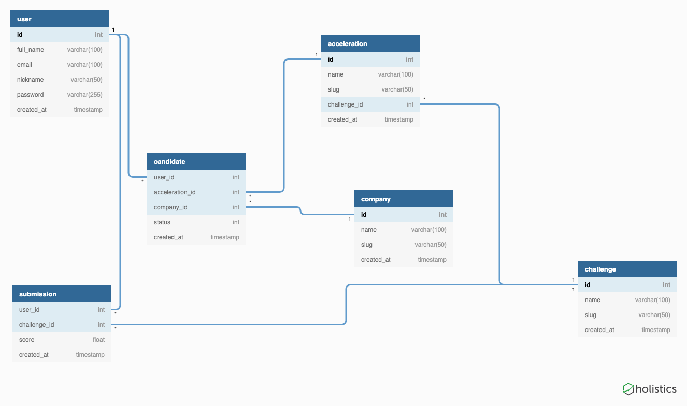

# ORM .Net

Utilizando o modo **code-first** em que o programador desenha as classes diretamente via código e depois gera o banco de dados.

Contém um projeto pré-configurado para usar o Entity Framework Core com banco de dados SQL Server LocalDB.

